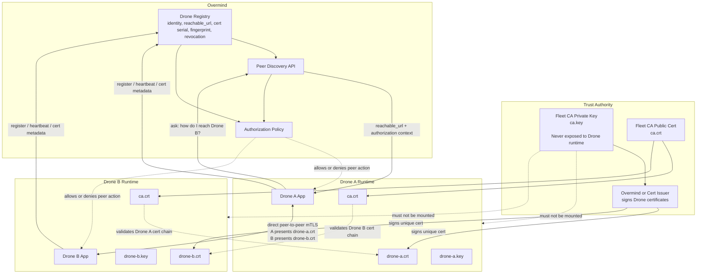
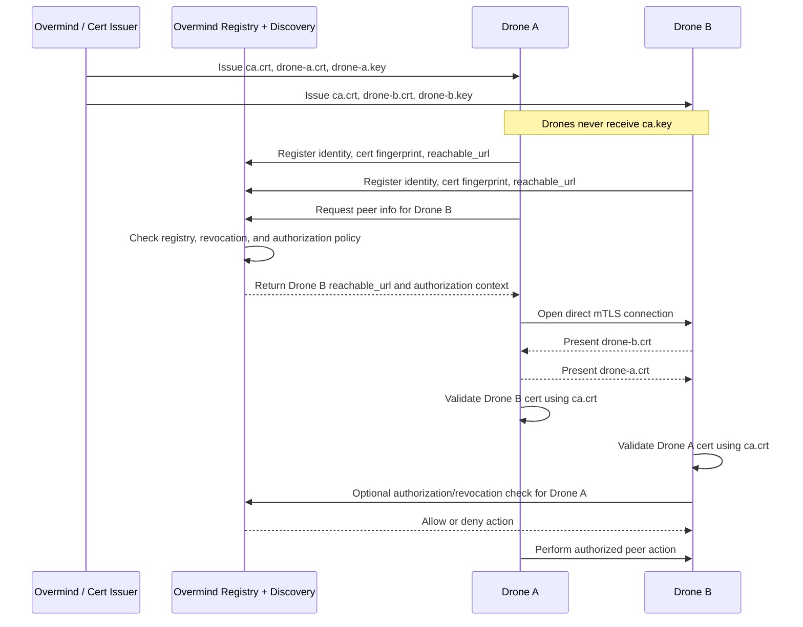

# Security

## Secure Peer-to-Peer Drone Communication via Overmind

Batocera Fleet Federation uses Overmind as the trust authority, discovery source, and authorization control point for secure peer-to-peer Drone communication.

The key design principle is:

```text
Overmind manages trust and discovery.
Drones communicate directly.
mTLS proves Drone identity.
Authorization controls what each Drone can do.
```

## 1. Overmind Acts as the Trust Authority

Overmind, or a dedicated certificate issuer controlled by Overmind, owns the fleet Certificate Authority private key:

```text
ca.key
```

This private key is used only to sign Drone certificates.

Drones must never receive this file.

## 2. Each Drone Gets a Unique Identity

Each Drone has a unique identity, such as:

```text
drone-a
drone-b
local-drone
batocera-living-room
batocera-cabin-arcade
```

That identity is bound to:

```text
DRONE_DEVICE_ID
Drone certificate subject
Drone certificate SANs
Overmind registration record
Authorization policy
```

## 3. Each Drone Receives Its Own Cert and Key

Each Drone receives only these files:

```text
ca.crt
drone.crt
drone.key
```

Where:

```text
ca.crt      Public CA certificate used to trust other Drones
drone.crt   Unique certificate for this Drone
drone.key   Private key for this Drone only
```

A Drone must not receive:

```text
ca.key
```

## 4. Drone Certificates Are Signed by the Shared Fleet CA

The trust model looks like this:

```text
Fleet CA
  ├── signs drone-a certificate
  ├── signs drone-b certificate
  ├── signs drone-c certificate
  └── signs drone-d certificate
```

All Drones trust the same CA public certificate, but each Drone has its own unique certificate and private key.

This provides a balance of:

- Fleet-wide trust
- Per-Drone identity
- Centralized revocation
- Operational simplicity
- Secure peer-to-peer communication

## 5. Overmind Tracks Drone Certificate Ownership

Overmind tracks certificate metadata for each Drone, including:

```text
drone_id
certificate serial
certificate fingerprint
certificate subject
certificate SANs
issued_at
expires_at
revoked_at
last_seen_at
reachable_url
```

This allows Overmind to determine:

```text
This certificate belongs to drone-a.
This certificate belongs to drone-b.
This certificate was rotated.
This certificate is revoked.
This Drone is allowed to talk to that Drone.
```

## 6. Overmind Provides Peer Discovery

When one Drone needs to communicate with another Drone, it asks Overmind for trusted peer information.

For example:

```text
drone-a asks Overmind:
  "How do I reach drone-b?"

Overmind responds:
  "Use https://drone-b:8443"
```

Overmind may return trusted connection metadata such as:

```text
target drone id
reachable_url
hostname
port
authorization status
optional certificate fingerprint
```

The Drone should prefer the Overmind-advertised reachable URL before falling back to direct IP resolution.

## 7. Drone-to-Drone Communication Uses mTLS

When `drone-a` connects to `drone-b`, both sides prove identity using mutual TLS.

```text
drone-a ---> drone-b
```

During the TLS handshake:

```text
drone-a presents drone-a.crt
drone-b presents drone-b.crt
```

Each side verifies:

```text
Was the certificate signed by the trusted fleet CA?
Is the certificate still valid?
Is the certificate expired?
Does the certificate identity match the expected Drone?
Is the certificate revoked?
Is this Drone authorized for this action?
```

## 8. mTLS Proves Identity, Application Authorization Controls Permissions

mTLS answers this question:

```text
Is this really a trusted Drone?
```

Application-level authorization answers this question:

```text
Is this Drone allowed to call this peer or perform this action?
```

Example authorization outcomes:

```text
drone-a may be allowed to read drone-b status.
drone-a may not be allowed to trigger sync on drone-b.
drone-c may be revoked entirely.
```

mTLS should not replace application authorization. It should prove machine identity. The application still decides what that identity is allowed to do.

## 9. Revocation Is Handled Centrally by Overmind

If a Drone is compromised, removed, rotated, or decommissioned, Overmind marks its certificate as revoked.

Other Drones should reject it based on:

```text
revoked certificate serial
revoked certificate fingerprint
inactive Drone registration
expired peer authorization
```

This prevents a removed or compromised Drone from continuing to participate in the fleet.

## 10. Local Testing Follows the Same Security Model

Local testing should behave like production.

The local certificate helper provisions certificates before startup:

```text
.github/scripts/provision-local-mtls-certs.sh
```

It may create local development files such as:

```text
.github/local-certs/ca/ca.crt
.github/local-certs/ca/ca.key
.github/local-certs/drones/drone-a/ca.crt
.github/local-certs/drones/drone-a/drone.crt
.github/local-certs/drones/drone-a/drone.key
```

However, only these files should be mounted into or exposed to a Drone runtime:

```text
ca.crt
drone.crt
drone.key
```

This file must not be mounted into or exposed to a Drone runtime:

```text
ca.key
```

For local Docker, each Drone container should receive only its own per-Drone cert directory.

For non-containerized local testing, `run_batocera_stack.sh` should use the same managed mTLS certificate model and point the local Drone process at pre-provisioned certs for `local-drone`.

## 11. Local and Production Parity

The Drone runtime should behave the same way locally and in production:

```text
Drone consumes pre-provisioned certificates.
Drone does not create a CA.
Drone does not sign certificates.
Drone does not receive ca.key.
Drone starts in DRONE_MTLS_MODE=managed.
```

Local development may create a CA on the host for convenience, but that CA private key must remain outside the Drone runtime.

## 12. Summary Flow

```text
1. Overmind owns or controls the fleet CA.
2. Each Drone has a unique identity.
3. Each Drone receives a unique cert/key signed by the fleet CA.
4. Drones receive ca.crt but never ca.key.
5. Overmind tracks Drone certs, reachability, revocation, and authorization.
6. Drone asks Overmind how to reach another Drone.
7. Drone connects directly to the peer Drone using mTLS.
8. Both Drones verify each other through the shared CA.
9. Application-level policy decides what the peer is allowed to do.
10. Overmind can revoke or rotate certificates centrally.
```

## 13. Required Runtime Files

A Drone runtime should have access to:

```text
DRONE_MTLS_CA_FILE=/path/to/ca.crt
DRONE_CERT_FILE=/path/to/drone.crt
DRONE_KEY_FILE=/path/to/drone.key
TLS_CERT_FILE=/path/to/drone.crt
TLS_KEY_FILE=/path/to/drone.key
```

A Drone runtime should not have access to:

```text
DRONE_MTLS_CA_KEY_FILE
ca.key
```

## 14. Recommended Defaults

For managed local and production execution:

```bash
DRONE_MTLS_MODE=managed
DRONE_MTLS_CA_FILE=/userdata/system/drone-app/certs/ca.crt
DRONE_CERT_FILE=/userdata/system/drone-app/certs/drone.crt
DRONE_KEY_FILE=/userdata/system/drone-app/certs/drone.key
TLS_CERT_FILE=/userdata/system/drone-app/certs/drone.crt
TLS_KEY_FILE=/userdata/system/drone-app/certs/drone.key
```

## 15. Security Rules

- Never share a single Drone certificate and key across multiple Drones.
- Never mount `ca.key` into a Drone runtime.
- Never allow the Drone runtime to silently create a CA.
- Never allow a Drone runtime to sign certificates for other Drones.
- Always give each Drone a unique `DRONE_DEVICE_ID`.
- Always include expected hostnames and IPs in certificate SANs.
- Always validate certificate chain, expiration, and key match before startup.
- Always use application-level authorization in addition to mTLS.
- Always allow Overmind to revoke or rotate Drone certificates.

## 16. Architecture Diagram



## 17. Communication Sequence


