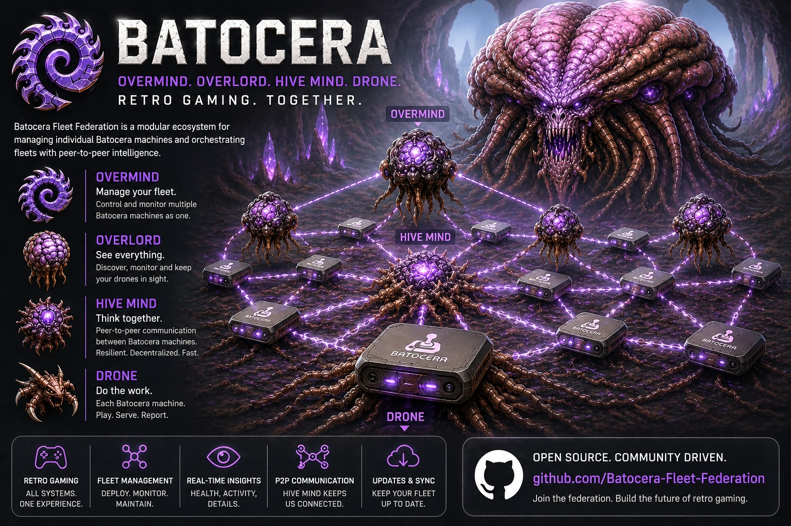

# Batocera Fleet Federation — Problem Statement & Vision

## TL;DR

- Overmind is the central hub. Drone runs on each Batocera device.
- Drones check in every 60 seconds, receive the swarm list, and test direct peer-to-peer connectivity.
- The local Docker Compose swarm runs one Overmind and four lightweight realistic Drone containers.
- Test ROMs go in `.github/data/roms/<system>/<files>` and are imported with `scripts/import-batocera-test-data.sh`.
- Drone containers copy different ROM subsets into their own Batocera-like `/userdata/roms` folders.
- Fake data is off by default. New Drones appear in Overmind as **Psionic connection detected** until approved.
- Drone onboarding uses an Overmind-generated authorization token instead of an integration password.
- Overmind shows a master ROM list and lets you request ROM/system sync without choosing the source Drone.
- Integration tests can run against Compose or externally provided Overmind/Drone URLs.

Local swarm quick start:

```bash
.github/scripts/import-batocera-test-data.sh
.github/scripts/swarm-up.sh
.github/scripts/run-integration-tests.sh
.github/scripts/swarm-down.sh --volumes
```

Modern retro gaming collections have evolved far beyond a single console sitting under a TV. Many enthusiasts now operate multiple Batocera systems across arcades, living rooms, handhelds, cabinets, and dedicated emulation servers. As collections grow, the operational complexity grows with them.

The Batocera Fleet Federation project was created to solve the visibility, management, and operational challenges that appear when running one — or many — Batocera systems at scale.

---

# The Problem

## 1. Limited Visibility Into Batocera Systems

Batocera is intentionally lightweight and appliance-like, which is excellent for gaming, but difficult for administration and troubleshooting.

When problems occur, users often have little or no visibility into:

- Emulator crashes
- Missing BIOS files
- Controller mapping issues
- Broken ROM metadata
- Audio/device conflicts
- Missing artwork
- Network connectivity issues
- Corrupt gamelists
- Failed scrapes
- Storage problems
- Performance bottlenecks
- Launch failures
- Invalid ROM references

Most troubleshooting today requires:

- SSH access
- Manual log inspection
- Navigating scattered configuration files
- Understanding emulator internals
- Reproducing issues directly on the device

This becomes increasingly difficult when managing multiple systems.

---

## 2. No Centralized Fleet Management

Once a user owns several Batocera machines, new operational challenges emerge:

- Which systems are online?
- Which systems are outdated?
- Which systems are missing ROMs?
- Which systems have different emulator settings?
- Which systems are actively being played?
- Which systems are failing?
- Which systems have artwork issues?
- Which systems have corrupted gamelists?
- Which systems have inconsistent controller mappings?
- Which systems have storage nearing capacity?
- Which systems are missing BIOS files?

Today, there is no unified operational layer for managing a fleet of Batocera devices.

Most users manually maintain:

- USB drives
- rsync scripts
- spreadsheets
- notes
- duplicated configs
- ad hoc backups
- inconsistent metadata

This does not scale.

---

## 3. ROM Metadata & Artwork Quality Problems

Large retro collections frequently suffer from inconsistent presentation quality:

- Missing marquee artwork
- Incorrect logos
- Low-quality box art
- Duplicate metadata
- Broken video previews
- Games incorrectly identified
- Invalid gamelist entries
- ROMs existing on disk but not in gamelists
- Gamelist references pointing to missing files

Maintaining polished frontends across thousands of games is extremely time consuming.

Users need tools that can:

- Detect missing assets
- Refine existing artwork
- Generate replacement marquees
- Compare metadata quality
- Validate gamelist integrity
- Synchronize metadata across systems

---

# The Solution

## Batocera Fleet Federation

Batocera Fleet Federation introduces a distributed management architecture for Batocera environments.

The platform consists of multiple coordinated components:

| Component | Purpose |
|---|---|
| Drone | Lightweight agent running on each Batocera machine |
| Overmind | Centralized fleet management and operational visibility platform |
| Hive Mind (planned) | Peer-to-peer federation and synchronization layer |

---

# What the Platform Enables

## Centralized Fleet Visibility

The platform provides operational awareness across all Batocera systems:

- Online/offline status
- System health
- Emulator failures
- Game launch failures
- Storage usage
- Network status
- Active sessions
- Recently played games
- Installed systems
- ROM inventories
- Emulator configurations
- Artwork completeness
- Log aggregation

Instead of SSH’ing into multiple devices individually, users gain centralized visibility into the entire fleet.

---

## Fleet-Wide Configuration Management

The project enables synchronization and comparison across machines:

- Emulator settings
- Controller mappings
- BIOS inventories
- ROM collections
- Metadata
- Artwork
- Themes
- Audio settings
- System configurations

Users can identify:

- Drift between systems
- Missing ROMs
- Inconsistent emulator versions
- Different configuration values
- Failed syncs
- Broken assets

This transforms Batocera management from manual maintenance into manageable infrastructure.

---

## Operational Troubleshooting

The platform improves debugging dramatically by exposing:

- Emulator logs
- System logs
- Runtime errors
- Metadata scan results
- Missing file detection
- Failed artwork scans
- Invalid gamelist references
- Network connectivity diagnostics

Instead of reactive debugging, users gain proactive operational awareness.

---

## Artwork & Metadata Refinement

The platform is designed to improve frontend quality across collections by helping users:

- Detect missing artwork
- Identify low-quality assets
- Generate replacement marquees
- Validate gamelist consistency
- Detect orphaned ROMs
- Compare metadata quality between systems
- Refine presentation quality at scale

The goal is not only operational management, but also preservation and curation quality.

---

# Long-Term Vision

The long-term vision is to treat fleets of Batocera systems similarly to managed infrastructure platforms.

Instead of isolated retro gaming boxes, users gain:

- Distributed retro gaming infrastructure
- Fleet-wide observability
- Consistent configuration management
- Metadata governance
- Automated synchronization
- Centralized diagnostics
- Cross-device awareness
- Operational tooling
- Peer-to-peer federation

Batocera Fleet Federation aims to become the operational layer for large-scale retro gaming environments.
